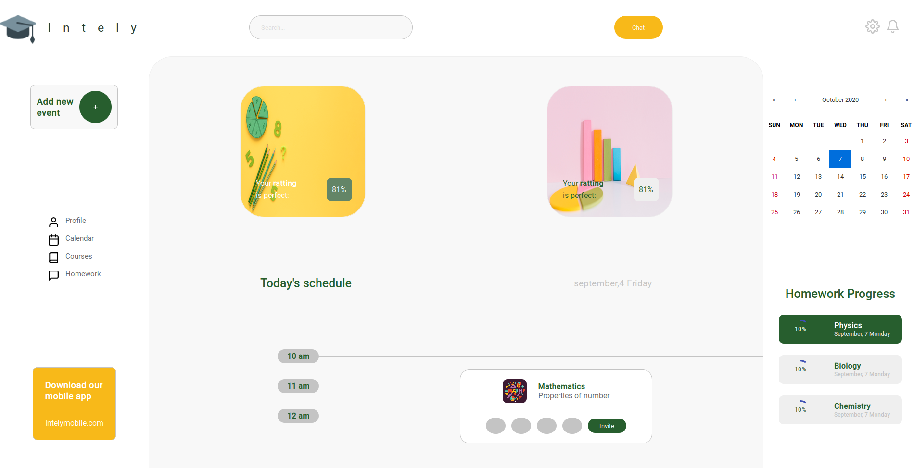

   

# Intely Web

---

# :pushpin: Table of Contents

- [:pushpin: Table of Contents](#pushpin-table-of-contents)
- [:rocket: Features](#rocket-features)
- [:construction_worker: Installation](#construction_worker-installation)
- [:runner: Getting Started](#runner-getting-started)
- [:postbox: Faq](#postbox-faq)
- [:bug: Issues](#bug-issues)
- [:closed_book: License](#closed_book-license)

 

# :rocket: Features

- UI - Intely Web

# :construction_worker: Installation

**You need to install [Node.js](https://nodejs.org/en/download/) and [Npm](https://www.npmjs.com/) first, then in order to clone the project via HTTPS, run this command:**

`git clone https://github.com/Vicenteefenequis/intely-web.git`

SSH URLs provide access to a Git repository via SSH, a secure protocol. If you have a SSH key registered in your Github account, clone the project using this command:

`git clone git@github.com:Vicenteefenequis/intely-web.git`

**Install dependencies**

`npm install` or `yarn`

# :runner: Getting Started

Run the following command in order to start the application in a development environment:

`npm start` or `yarn start`

# :postbox: Faq

**Question:** What are the tecnologies used in this project?

**Answer:** The tecnologies used in this project are **REACT** + **Styled-components** to handle scoped CSS and

# :bug: Issues

Feel free to **file a new issue** with a respective title and description on the [Intely Web](https://github.com/Vicenteefenequis/intely-web/issues) repository. If you already found a solution to your problem, **i would love to review your pull request**!

# :closed_book: License

Released in 2020 (Work in progress)
This project is under the [MIT license](https://github.com/VicenteEfenequis/intely-web/master/LICENSE).

Made with love by [Vicente Nascimento](https://github.com/VicenteEfenequis) 💜🚀
